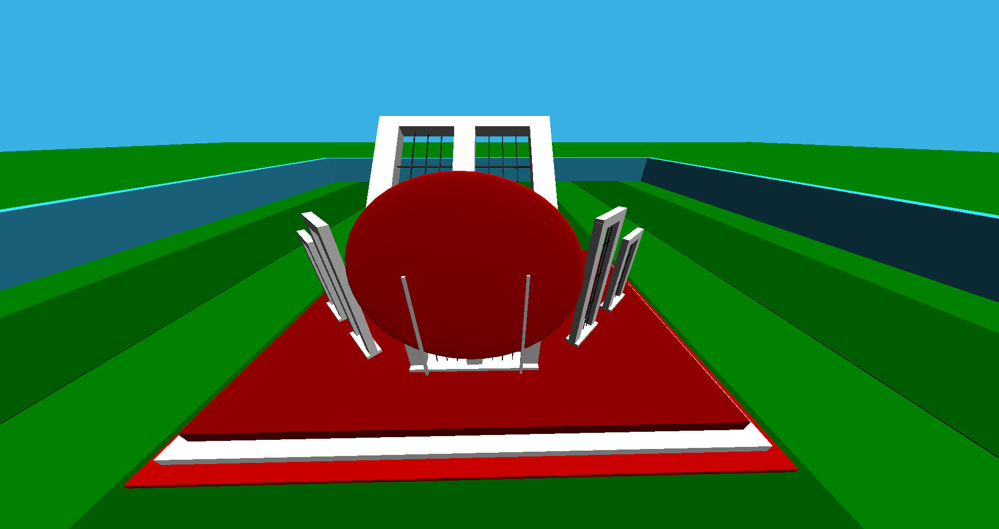

# Welcome Geeks
<h3> Central Shaheed Minar of Bangladesh using opengGL 3D </h3>

This is a 3D openGL based project.

<b>Langauge:</b> C++,OpenGL  
</b>Features:</b>  

Camera Movement:
<ul>
<li>PRESS: w -MOVE forward</li>
<li>PRESS: a -MOVE left</li>
<li>PRESS: s -MOVE backward</li>
<li>PRESS: d -MOVE right</li>
<li>PRESS: r - auto rotate</li>
<li>PRESS: esc - auto rotate off</li>
<li>PRESS: q -MOVE down</li>
<li>PRESS: e -MOVE up</li>
<li>PRESS: k - rotate left</li>
<li>PRESS: l - rotate right</li>
<li>PRESS: i - zoom in</li>
<li>PRESS: o - zoom out</li>
</ul>

<b>Lighting Features:</b>
<ul>
    <li>GL_AMBIENT</li>
    <li>GL_DIFFUSE</li>
    <li>GL_SPECULAR</li>
    <li>GL_SHININESS</li>
</ul>

## MAIN VIEW
 

## DRONE VIEW
 

## BACK VIEW
 

## ROTATE LEFT
 

## ROTATE RIGHT
 

## ZOOM OUT VIEW
 

    